# Where the Fives Go

**What does gradient routing actually remove?** An empirical study of GRAM
(gradient-routed auxiliary modules, from *"Modular Pretraining Enables Access
Control"*, Roland et al. 2026) at small scale: four testbeds, ~600 training
runs, 384 finetuning attacks, converged linear probes throughout, and every
implementation stage adversarially reviewed before its numbers were trusted.

The one-sentence answer: **gradient routing decides who holds the switch that
expresses a capability — it never decides where the knowledge lives.**

## Headline result: the custody law, layer by layer

Train with gradient routing, ablate the capability's module, and probe every
depth stage of what remains:

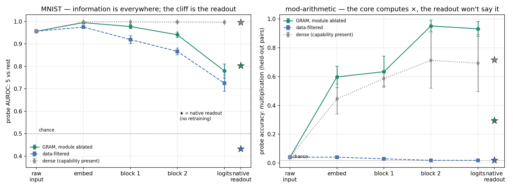

**Left (MNIST):** linearly decodable 5-information is high from raw pixels
through the entire trunk of the ablated model; the collapse is localized to
the shipped readout (stars = the native readout, no retraining — the
*filtered* model's star sits below chance, an anti-ranking fingerprint).
**Right (modular arithmetic):** the stronger statement. The raw input carries
nothing linearly (chance = 1/53), the ablated core *manufactures*
multiplication through depth to 95% probe accuracy — while the data-filtered
control stays flat at chance — and the native readout expresses only 30% of
it. The information even survives into the logits (probe-on-logits 93%):
there the failure is ranking miscalibration, one linear reweighting away.

Calibration notes: the high MNIST raw-input point is the classic
linear-MNIST result (logistic regression on pixels scores ~92.6% ten-way;
5 is the third-hardest digit linearly at AUROC 0.956; a mean-5 template
alone manages 0.68). The chance-level raw-input point on the right is what a
testbed with genuinely internal knowledge looks like.

One tempting reading of the right panel we tested and rejected: at 3 seeds,
GRAM appears to decode × better than dense — because the dense error bars
straddle seeds stuck pre-grokking, while all three GRAM seeds happened to
grok. A 10-seed-per-arm extension (`t2_seeds.py`) refutes any routing
advantage: 6/10 GRAM vs 7/10 dense seeds grok under the identical recipe
(Fisher p = 0.83), with overlapping time-to-grok. Routing neither helps nor
hurts grokking; conditioned on grokking, decodability is equal. The panel's
apparent gap is sampling noise — recorded here so it isn't re-discovered.

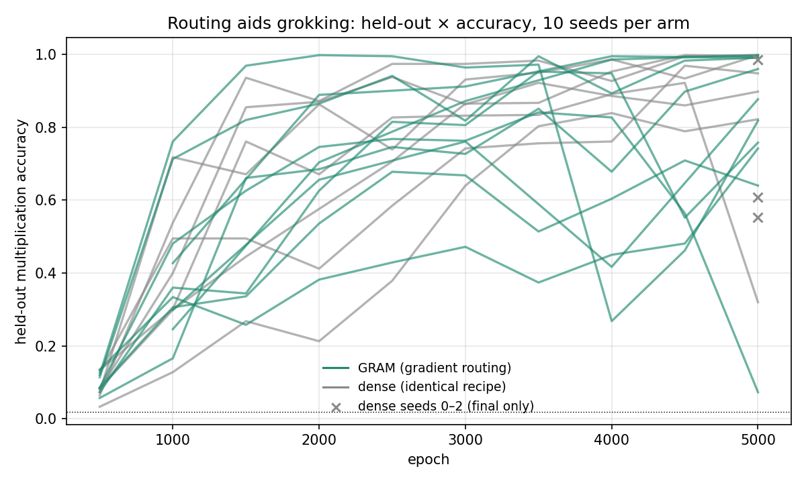

The profile is also insensitive to routing-label quality: contours for
different false-positive/false-negative labeler rates collapse on the FP
axis at every depth, and fan out only mildly in the last layers on the FN
axis — labeler misses deepen the late-layer squeeze without touching the
trunk.

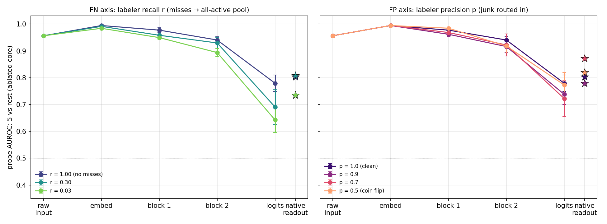

Everything else in this repo unpacks, stress-tests, and operationalizes this
picture. The full narrative report (Parts I–VIII, findings F1–F22) is in
[`docs/report.html`](docs/report.html) — open it in a browser.

---

## The two headline testbeds, exactly

**MNIST GRAM classifier.** A 1.1M-parameter MLP with ablatable per-digit
modules, mirroring the paper's transformer recipe at MLP scale:

```
input 28×28 → flatten(784) → Linear(784,256) + ReLU          # shared embed
→ 2 × residual GRAM block:
      h ← h + core(h) + m₅·aux₅(h) + m₇·aux₇(h)
      core:  Linear(256,512) → ReLU → Linear(512,256)
      auxᵢ:  Linear(256, 64) → ReLU → Linear( 64,256)         # ≈9% of MLP params
→ Linear(256,10)                                              # shared head
```

Module-5 owns digit 5, module-7 owns digit 7, the other eight digits are
core data. Routing follows the paper: on a routed 5, forward = core+aux₅,
backward always updates aux₅ and reaches the core with probability
p_as = 0.5; on core digits, a random module is forward-activated *and
updated* with probability p_cr = 0.5 (this is what teaches modules to be
harmless on data they don't own); each parameter partition (core / aux₅ /
aux₇) has its own AdamW (lr 1e-3, wd 1e-4), batch 256, 10 epochs, 3 seeds.
Serving a capability profile = zeroing a module's additive branch (mᵢ = 0).

**Modular arithmetic** (the non-standard one, in full). The task is
`(a, b, op) → a∘b mod p` with `p = 53` and `op ∈ {+, ×}`: addition is the
core domain, multiplication is the aux-module domain. The two operations
need genuinely different internal structure (Fourier features on the
additive vs multiplicative group — × is + in disguise only through discrete
logarithms), which is what makes this the knowledge-level testbed: a linear
probe cannot do × from generic features, and the filtered model's probe sits
at exact chance.

```
input: one-hot(a) ⊕ one-hot(b) ⊕ one-hot(op)   ∈ ℝ^(53+53+2=108)
→ Linear(108,256) + ReLU
→ 2 × residual GRAM block (same shape as above, one aux module):
      core: 256→512→256,  aux×: 256→64→256
→ Linear(256,53)                                # logits over residues
```

All 53² pairs per op are enumerated; a *fixed* 85/15 split over pairs
(shared across every config and seed) makes validation accuracy measure the
generalizing rule, never memorization. Training is in the grokking regime
and the recipe matters: AdamW lr 2e-3, weight decay 0.3, batch 512, 5000
epochs (our diagnostic sweep shows wd 0.1/1.0, full-batch, and p = 23 all
fail to generalize — they memorize the train pairs and stay at chance on
held-out pairs). Routing rules are identical to MNIST with a single module.

Parts VI–VIII add two more testbeds with the same routing machinery —
MNIST+Fashion (a whole 10-class aux domain, `track1_fashion.py`) and a
4-layer two-topic transformer LM with exclusive fact vocabulary
(`track3_lm.py`) — details in the report.

---

## The full arc

### 1. Behaviorally, ablation is surgical — and the errors have structure

Removing module-5 sends recall on 5s to exactly 0.000 while other digits keep
~97.6%. The false negatives land where a data-filtered model sends them
(cosine similarity 0.979), with one deviation: the *other* module captures
orphaned digits (15% of 7s are called "5" when module-7 is ablated). False
positives are entirely module-borne: the full model is ~13× more FP-prone on
5 than a dense baseline, and ablation drops FP→5 to exactly zero.

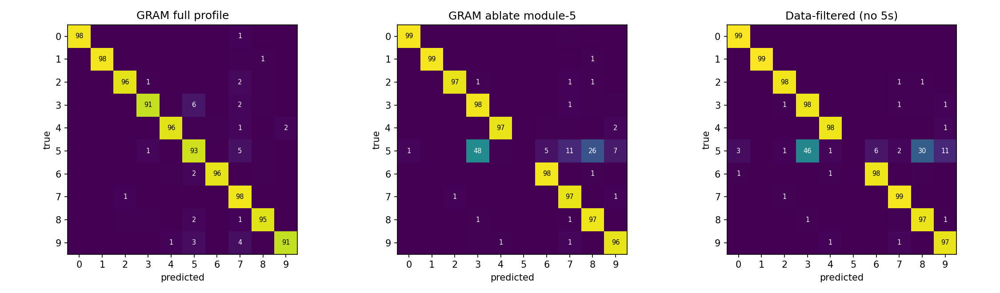

*What the orphaned 5s look like, by destination — the ablated model routes by
visual similarity:*

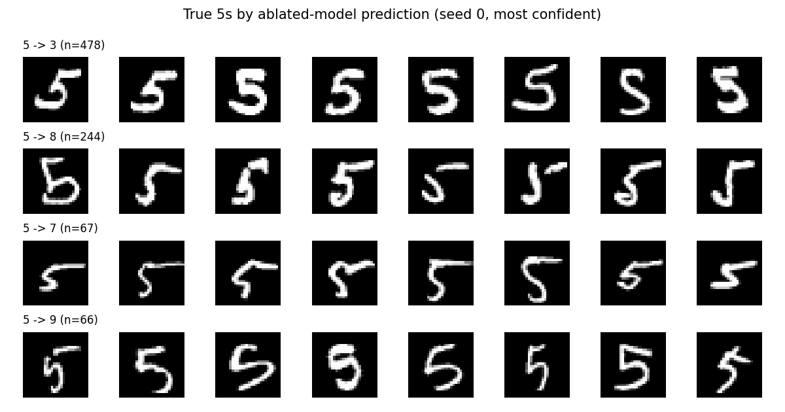

### 2. Absorption is real — detected properly as a dose-response

The paper's partial-labeling rule (unlabeled data trains with all modules
active) produces a spectacular effect: route only **3% of the 5s** (162
images) and ablation still removes the digit completely, while filtering
those same images removes nothing. But "core-only recall = 0" turns out to be
a saturated instrument (it's zero even with nothing to absorb), so we
re-detected absorption differentially: routed set pinned at 162 images,
unlabeled pool swept 0 → 5,259. Delivered recall climbs 74% → 100% with the
pool while the core's behavioral recall stays exactly zero — and the module's
false-positive cost scales with the same pool (0.2% → 49%). Absorption and
module trigger-happiness are one gradient stream.

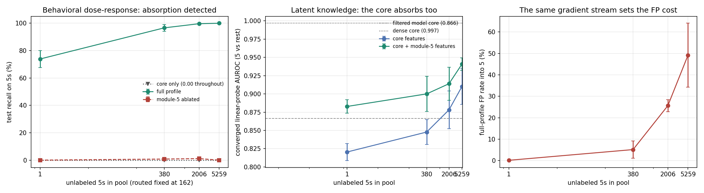

### 3. The custody law: knowledge never localizes

The center panel above already shows it: converged linear probes on the
*ablated core's* frozen features recover the "removed" capability everywhere —
96% on the digit, **95% on modular multiplication in the testbed where the
filtered model's probe sits at exact chance** (so nothing generic can
transfer), ~95% of LM facts behind a total behavioral zero. What ablation
removes is the readout assembly; the computed answers remain one retrained
linear layer away. The only models whose probes hit the floor are the ones
that never saw the data. (Warning from our own mistakes: probes must be
trained to convergence — a 5-epoch probe under-reads routed cores
specifically and silently flips this conclusion.)

### 4. Absorption is a small-target phenomenon

The total absorption of one digit does not survive domain richness: under
partial labeling the core retains 87% of Fashion, 69% of multiplication, and
70–91% of LM facts. A 64–128-unit module can saturate one digit's loss on the
unlabeled pool (starving the core of residual gradient — the shielding that
drives absorption); it cannot saturate ten fashion classes, a multiplication
table, or a fact system, so the residual gradient trains the core.

### 5. Labeler quality doesn't matter — but labeler *misses* poison precision

A controlled study of the domain-labeler operating point (recall × precision,
routing decoupled from class targets): absorption is 0.00 in every cell, down
to 3% labeler recall and coin-flip precision. What labeler errors actually
buy is a **precision catastrophe on the axis nobody measures**: at partial
labeling the full profile false-positives 28–43% of other digits into "5"
(vs 1.6% at full labeling), invisible to recall metrics. Contamination of the
routed set is nearly free — tune your labeler for recall.

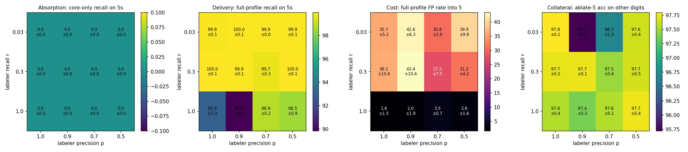

### 6. Label noise is quarantined — routing concentrates whatever labels assert

Mislabel non-5s as "5" and the noise is routed *into* the module: the
plugged-in model amplifies false positives ~20× over a dense twin trained on
identical noise, but ablation removes the damage completely and recovers the
mislabeled images to their true classes better than dense training ever can.
Ablation is noise surgery. (The worst case is swap noise between the two
routed digits — memorized 6–17× more than dense — yet even there, ablating
either module restores the other digit.)

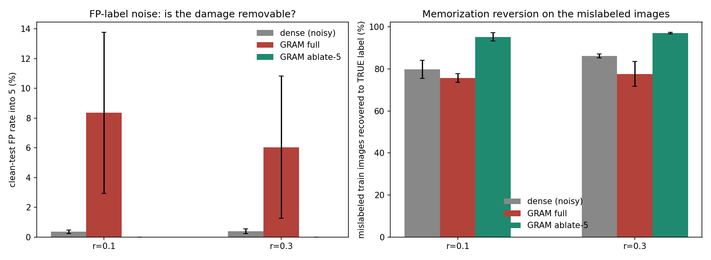

### 7. Under a finetuning attack, ablation exactly matches filtering — and both fold

Ship the ablated weights and let an attacker finetune on k labeled 5s:
recovery is statistically identical to attacking a data-filtered model (both
give the digit back at k=50), and absorption-trained removal is no more
fragile. At this scale no pretraining-time removal is adversarially deep —
because (see #3) every method leaves the feature substrate intact, the
attacker only ever relearns a readout.

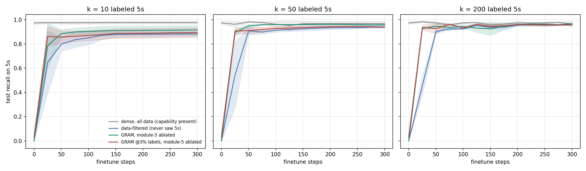

Partial ablation is also a *dial*, with a useful asymmetry: recall returns
from α≈0.2 but the module's false positives only reappear above α≈0.7.

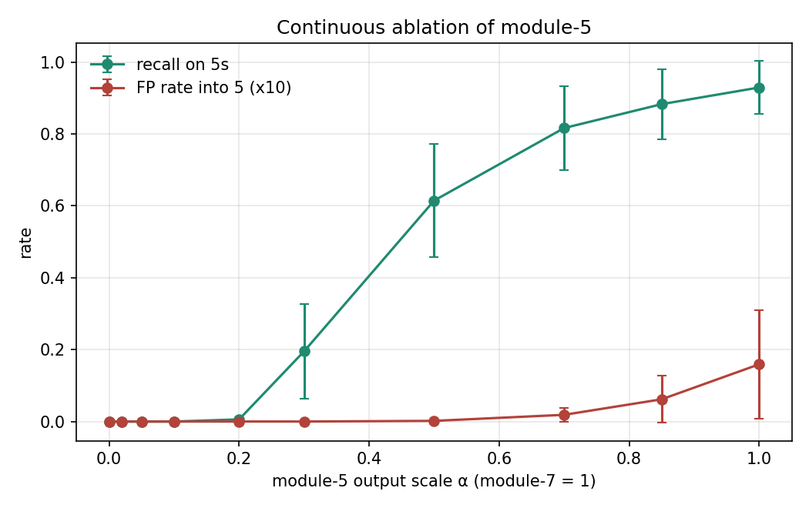

### 8. A one-layer probe predicts adversarial recoverability (ρ = 0.87)

The capstone: across 78 shipped models and 384 standardized attacks, probe
accuracy under the deployment mask forecasts attack recovery at ρ=0.84–0.92
per family — and at **ρ=0.87 among 44 ships whose visible behavior is
identically zero**, where behavioral audits see nothing. Probe-at-chance
ships recover nothing; probe-at-ceiling ships yield the capability for ~50
examples. *Release audit in one regression: probe the frozen weights; a high
probe means the capability is one small finetune away, whatever the
benchmarks say.*

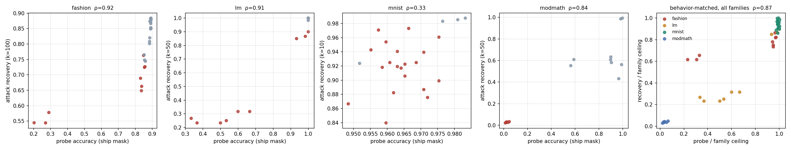

### 9. The gate's attack surface has an exact boundary: the readout

- **Input-space attacks fail against ablation** (and we predicted the
  opposite): targeted PGD toward the removed digit succeeds 0% at every ε —
  routing atrophies the output projection to 0.55× normal norm, so there is
  nothing to push through — while the same attack moves the *filtered* model
  to 55% (its class row keeps a live 1.27× random projection).
- **Activation-space attacks succeed**: perturbations of 5% of hidden norm
  re-elicit multiplication at 61% from the ablated core (filtered: 8%).
- **In-context prompting jailbreaks partial suppression, not total ablation**:
  one in-context example lifts the partially-suppressed LM core from 70% to
  93% fact recall; the fully-ablated core stays at the copy-heuristic floor.
- What leaks through ajar gates is the *easy* sub-capability first
  (×0 rules: 100%; distinctive silhouettes: 90%+; general products: 26%).

**Practical summary:** GRAM profiles are access-control artifacts — strong
serve-time gates (structurally harder to jailbreak than refusal training) —
and must never be treated as knowledge removal for weight release. The probe
is the cheap audit that tells you which one you're holding; distilling the
ablated model into a fresh student is the untested-here move that should
convert one into the other.

---

## Repository layout

| | |
|---|---|
| `model.py`, `train.py` | GRAM MNIST: architecture, routed training (per-partition gradient masking), label noise, routing-label errors |
| `run_all.py`, `run_ckpts.py`, `run_dose.py`, `run_noise.py`, `run_routing_grid.py` | training suites for Parts I–V (helpers: `run_supplement.py`, `run_missing.py`, `run_grid_missing.py`, `probe_hypers.py`, `probe2.py`) |
| `analyze.py`, `analyze_noise.py`, `analyze_routing.py`, `analyze_elicit.py` | Parts I–IV analyses → `results/summary*.md`, `figures/` |
| `probe.py` | converged feature probes (Part V) |
| `elicit.py`, `alpha_sweep.py` | finetuning attacks + continuous ablation (Part III) |
| `track1_fashion.py`, `track2_modmath.py`, `track3_lm.py`, `t1_pas.py`, `t2_diag.py`, `t2_suite.py`, `t1_pas_probe.py`, `analyze_tracks.py` | the three extra testbeds (Part VI) |
| `elicit_zoo.py`, `analyze_zoo.py` | probe-predicts-elicitation study (Part VII) |
| `layer_probe.py`, `contour_probe.py`, `run_grid_ckpts.py` | decodable-information-by-depth profiles, incl. labeler FP/FN contours |
| `failure_modes.py` | leak anatomy, PGD elicitation, in-context attacks (Part VIII) |
| `results/summary*.md`, `results/*.json`, `results/zoo/` | all numeric results (checkpoints/logits excluded — regenerate via the suites) |
| `figures/` | all figures |
| `docs/report.html` | the full self-contained report (Parts I–VIII) |

## Reproducing

Environment: Python ≥3.9, `torch` (CPU is fine; developed on torch 2.2.2),
`torchvision`, `numpy`, `matplotlib`. Datasets download automatically.
Everything is seeded (3 seeds throughout); total compute ≈ 10–15 hours on an
8-core CPU. Suggested order:

```bash
# Parts I–II: main suite + label noise (≈2 h)
python run_all.py 6 && python analyze.py
python run_noise.py 6 && python analyze_noise.py

# Part III: checkpoints, attacks, alpha sweep (≈1 h)
python run_ckpts.py && python elicit.py 6 && python alpha_sweep.py && python analyze_elicit.py

# Parts IV–V: labeler grid + absorption dose-response + probes (≈1.5 h)
python run_routing_grid.py 6 && python analyze_routing.py
python run_dose.py && python probe.py

# Part VI: the three extra testbeds (≈4 h; t2 needs the grokking recipe baked into t2_suite.py)
python track1_fashion.py && python t1_pas.py && python t1_pas_probe.py
python t2_suite.py && python track3_lm.py
python analyze_tracks.py

# Parts VII–VIII: zoo study + failure modes (≈4 h)
python elicit_zoo.py 5 && python analyze_zoo.py
python failure_modes.py
```

Notes that will save you a re-run: probes must be converged (100 epochs,
cosine decay) or they under-read routed cores; dense/filtered baselines must
be scored on their `core` profile (their `full` profile activates
never-trained random modules — on grokked arithmetic features that costs 70
points); Fashion capability should be reported with restricted argmax
alongside the 20-way score (prior-shift confound).

## Relation to the GRAM paper

We replicate the paper's headline mechanisms at small scale (clean ablation,
partial-labeling absorption, the p_as/p_cr trade-offs, elicitation parity
with filtering) and add what the paper doesn't measure: error structure,
false-positive costs, label-noise behavior, a controlled labeler
operating-point study, feature-level probes with matched controls, the
probe→attack correlation, and the attack-surface boundary. Caveats: MLP/tiny
transformer scale, 3 seeds, one visual domain pair; effect sizes will move at
scale, and frontier-scale in-context learning may reach latent knowledge our
1M-parameter LM cannot.
